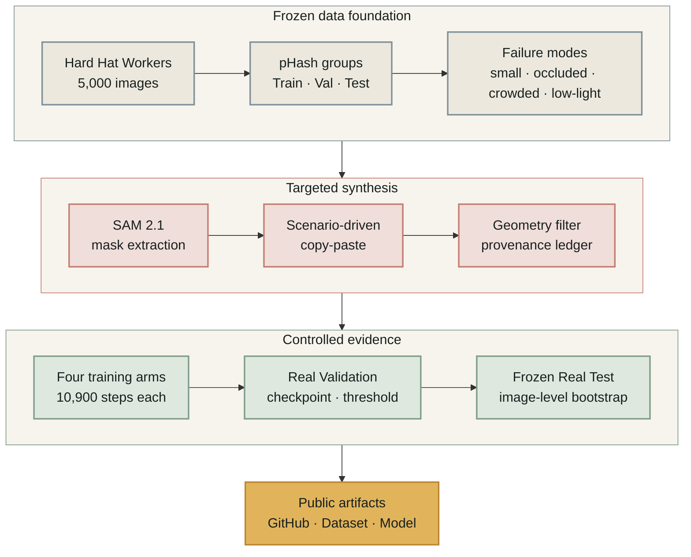

<div align="center">

# SafeSynth

**Targeted Synthetic Data 對 Hard-Hat Detection 真的有效嗎？**

以 frozen split、four-arm controlled ablation、artifact gate 與 image-level bootstrap，
把「看起來合理」的 Synthetic Data 轉成可重現、可否證的實驗。

[](https://github.com/kuotunyu/SafeSynth/actions/workflows/ci.yml)

[Dataset](https://huggingface.co/datasets/steven0226/safesynth-hard-hat) ·
[Model](https://huggingface.co/steven0226/safesynth-rtdetrv2-r18) ·
[Latest Release](https://github.com/kuotunyu/SafeSynth/releases/latest) ·
[Experiment Protocol](docs/experiment_protocol.md)

</div>

> **結論先講：** RT-DETRv2-R18 加入 Synthetic Data 後，`primary_map_small` 反而下降；
> RF-DETR-Nano 的 point estimate 方向相反，但 confidence intervals 重疊。
> SafeSynth 保存這個負結果，而不是只挑一個看起來成功的數字。

## 核心發現

- **RT-DETRv2-R18：** `real_only` 取得最高 `primary_map_small = 0.4511`；最佳
  synthetic arm 為 `unfiltered_syn = 0.3759`。
- **RF-DETR-Nano：** `filtered_syn = 0.5030` 高於 `real_only = 0.4841`，但 95%
  bootstrap intervals 重疊，不能宣稱穩健提升。
- **Artifact gate：** pre-registered H4 上限為 AUC 0.60，實測 **AUC 0.9053**；
  H4 **did not pass**，代表 pasted 與 real patches 仍有明顯可分訊號。
- **研究邊界：** All claims are relative; never absolute AP。所有主張只比較同一個
  frozen Test 上的 arm-to-arm 差異。


## Demo

Demo 先呈現 Before／After 與偵測結果，再顯示 compliance verdict、counts、confidence、
latency、checkpoint 與 runtime。預設使用公開的 `real_only` checkpoint，不因展示需求改寫
模型或 threshold。


<details>
<summary><strong>查看 Validation montage</strong></summary>


Montage 使用 Validation 影像，不使用 Test。黃色為 helmeted head，紅色為 bare head；
caption 顯示 `compliant / total` 與 compliance rate。

</details>

## 實驗流程

SafeSynth 先凍結資料，再針對實際 failure modes 生成與過濾影像。Validation 只用來選
checkpoint 與 operating point；Frozen Test 最後執行一次，並公開完整結果與負結果。



四組實驗共用 split、base model、seed、optimizer-step budget 與 evaluation code；只有
training stream 不同。

| Arm | Training stream | 實驗角色 |
|---|---|---|
| `real_only` | 全部 Real Train | 主 baseline |
| `standard_aug` | Real Train + standard augmentation | augmentation control |
| `unfiltered_syn` | Real Train + unfiltered synthetic | generation effect |
| `filtered_syn` | Real Train + filtered synthetic | filtering effect |

本研究採 **four-arm**，不是 five-arm。第五組 Full-real 不適用，因為 `real_only` 已使用
**all real Train data**，不存在更高的 real-data ceiling。

## 主要結果

下表由 [`results/detection_metrics.csv`](results/detection_metrics.csv) 重新聚合；CI 執行
`scripts.verify_readme`，避免 README 與實驗輸出分離。

| Arm | primary_map_small <!--split: test--> | primary_map <!--split: test--> | bare_head_recall <!--split: test--> | real-image exposures |
|---|---:|---:|---:|---:|
| `real_only` | 0.4511 | 0.5341 | 0.9875 | 49.83 |
| `standard_aug` | 0.4236 | 0.4958 | 0.9875 | 49.83 |
| `unfiltered_syn` | 0.3759 | 0.4597 | 0.9898 | 24.91 |
| `filtered_syn` | 0.3664 | 0.4858 | 0.9886 | 24.91 |

Synthetic arms 的 real-image exposures 只有一半，因此差距不能全部歸因於合成影像品質。
`filtered_syn` 達成 compliance precision 的 deployment constraint，但沒有換到更高 AP。

<details>
<summary><strong>RF-DETR-Nano replication 與 confidence intervals</strong></summary>

相同 four-arm protocol 換成 RF-DETR-Nano 後，Synthetic Data 的 point estimate 轉為正向；
interval 仍重疊，因此只報告 model-dependent signal，不宣稱穩健 win。

<!--metrics-source: rfdetr_detection_metrics.csv-->
| Arm | primary_map_small <!--split: test--> | primary_map <!--split: test--> | bare_head_recall <!--split: test--> | real_image_exposures <!--split: test--> |
|---|---:|---:|---:|---:|
| `real_only` | 0.4841 [0.4653, 0.5048] | 0.5657 | 0.9761 [0.9643, 0.9863] | 49.83 |
| `standard_aug` | 0.4970 [0.4727, 0.5219] | 0.5789 | 0.9681 [0.9539, 0.9809] | 49.83 |
| `unfiltered_syn` | 0.4959 [0.4747, 0.5194] | 0.5774 | 0.9750 [0.9596, 0.9865] | 24.91 |
| `filtered_syn` | 0.5030 [0.4841, 0.5240] | 0.5818 | 0.9863 [0.9777, 0.9938] | 24.91 |

</details>

## 負結果帶來什麼

- **H4 先指出 domain gap。** AUC 0.9053 顯示 real 與 pasted patches 有明顯可分訊號；
  依 [ADR-011](docs/decisions.md#adr-011)，專案停止擴增到 2x，保留 1x 實驗結果。
- **Filter 不是免費午餐。** 它改善特定 deployment constraint，卻沒有保證提升 detector AP。
- **Model choice 會改變方向。** RT-DETRv2 與 RF-DETR-Nano 的結果不同，不能從
  single architecture 推廣成普遍結論。

## 證據邊界

- 原始資料是 [Hard Hat Workers](https://www.kaggle.com/datasets/andrewmvd/hard-hat-detection)
  （CC0 1.0），共 5,000 張影像。
- [SHEL5K（Sensors 2022）](https://www.mdpi.com/1424-8220/22/6/2315) 對相同影像重新
  標註後得到 **75,570 labels**，原始版本只有 **25,502**；因此 `person` 不承擔主要結論。
- Synthetic Dataset 公開 filtered / unfiltered annotations、image SHA-256 與
  `records.jsonl` provenance；它們不是 Validation 或 Test ground truth。
- Split 以 pHash groups 凍結並以 SHA-256 manifest 驗證；generator 與 filter 不讀取
  Validation / Test labels。

<details>
<summary><strong>Known limitations</strong></summary>

- 原始 annotation 不完整，所有數值只適合做同一 frozen Test 上的相對比較。
- Copy-paste 在有限 backgrounds 上會飽和，且 H4 已證實殘留 artifact signal。
- 主實驗與 replication 都是 single-seed training；bootstrap 衡量 Test image sampling
  uncertainty，不等同 run-to-run variance。
- 公開 release 不主張 RF-DETR latency；固定時脈 benchmark 未通過 host-contention p95 gate。

</details>

## Installation & Reproduction

### Requirements

- Windows 11, native environment (WSL is not used)
- Python 3.12 and [uv](https://docs.astral.sh/uv/)
- CPU for verification and the default demo path; CUDA is optional for faster inference or training

### Clone and verify

```powershell
git clone https://github.com/kuotunyu/SafeSynth.git
Set-Location SafeSynth
uv sync --locked

uv run ruff check .
uv run pytest -q
uv run python -m scripts.verify_readme
uv run python -m scripts.check_forbidden_licences
```

### Run the demo with public weights

```powershell
uvx hf download steven0226/safesynth-rtdetrv2-r18 `
  --local-dir models/safesynth-rtdetrv2-r18

uv run python app.py `
  --device cpu `
  --weights models/safesynth-rtdetrv2-r18
```

Open `http://127.0.0.1:7860` after the server starts. On a compatible NVIDIA GPU, replace
`--device cpu` with `--device cuda`.

### Reproduce the experiments

Large images and checkpoints stay outside Git. Configure the data locations in
[`configs/paths.yaml`](configs/paths.yaml), then follow the frozen contracts:

- [Data protocol](docs/data_protocol.md)
- [Synthesis specification](docs/synthesis_spec.md)
- [Filtering specification](docs/filtering_spec.md)
- [Training specification](docs/training_spec.md)
- [Evaluation specification](docs/evaluation_spec.md)
- [Environment and CUDA notes](docs/environment.md)

Verify locally prepared release bundles with:

```powershell
uv run python -m scripts.verify_hf_release `
  --dataset <dataset-bundle> `
  --model <model-bundle>
```

<details>
<summary><strong>Repository map</strong></summary>

| Path | Responsibility |
|---|---|
| `src/` | Data, synthesis, training, inference, evaluation and release code |
| `configs/` | Frozen experiment configuration |
| `scripts/` | Reproducible command-line entry points and verification gates |
| `tests/` | Unit, contract, evidence and regression tests |
| `results/` | Machine-readable metrics used by README verification |
| `reports/` | Scientific reports and curated figures |
| `publishing/` | Release notes and Hugging Face cards |

</details>

## 授權與引用

原始程式碼採 [MIT License](LICENSE)；原始資料集採 CC0 1.0；SAM 2.1 權重遵循
Apache-2.0。引用本研究時，請固定對應的 [GitHub Release](https://github.com/kuotunyu/SafeSynth/releases)
並搭配 [Hugging Face Dataset](https://huggingface.co/datasets/steven0226/safesynth-hard-hat)。
