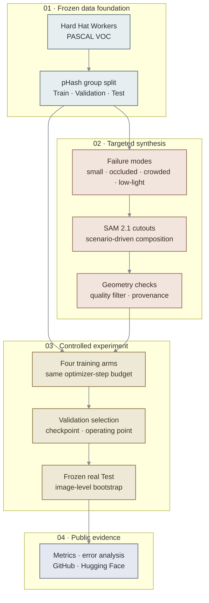
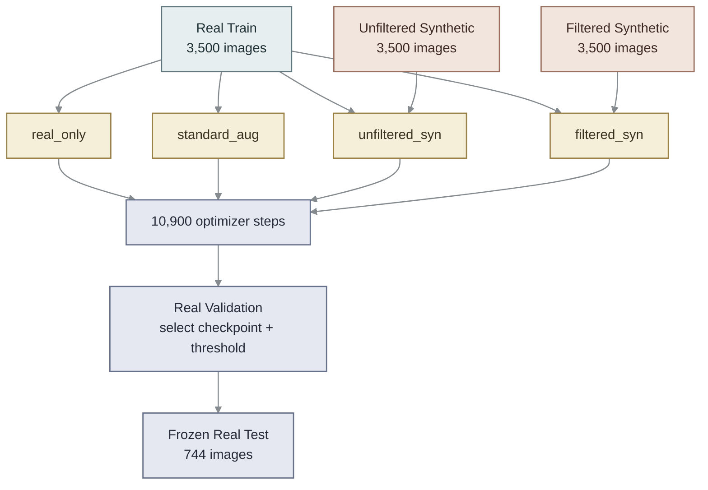
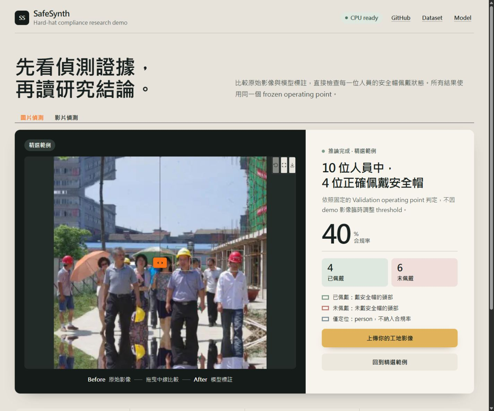

<div align="center">

# SafeSynth

**Targeted Synthetic Data 對 Hard-Hat Detection 真的有效嗎？**

以 frozen split、four-arm controlled ablation、artifact gate 與 image-level bootstrap，
把「看起來更像資料」轉成可重現、可否證的實驗。

[](https://github.com/kuotunyu/SafeSynth/actions/workflows/ci.yml)

[Dataset](https://huggingface.co/datasets/steven0226/safesynth-hard-hat) ·
[Model](https://huggingface.co/steven0226/safesynth-rtdetrv2-r18) ·
[Release](https://github.com/kuotunyu/SafeSynth/releases/tag/v1.0.0) ·
[Experiment Protocol](docs/experiment_protocol.md)

</div>

> **結論先講：** 在 RT-DETRv2-R18 上，加入 Synthetic Data 反而降低
> `primary_map_small`；RF-DETR-Nano 的 point estimate 方向相反，但 confidence
> intervals 重疊。SafeSynth 因此不是一份「Synthetic Data 一定有效」的宣傳，
> 而是一套能辨識失敗、保存負結果、公開證據的研究流程。

## 一眼看懂

- **RT-DETRv2-R18：** `real_only` 取得最高 `primary_map_small = 0.4511`；最佳
  synthetic arm 為 `unfiltered_syn = 0.3759`。
- **RF-DETR-Nano：** `filtered_syn = 0.5030` 高於 `real_only = 0.4841`，但 95%
  bootstrap intervals 仍重疊，不能宣稱穩健提升。
- **Artifact gate：** pre-registered H4 上限是 AUC 0.60，實測 **AUC 0.9053**；
  H4 **did not pass**，顯示 pasted 與 real patches 存在明顯可分訊號。
- **研究立場：** All claims are relative; never absolute AP。所有主張只比較同一個
  frozen Test 上的 arm-to-arm 差異。


## 從資料到結論

SafeSynth 不追求無限制 bulk generation；它先定義實際 failure modes，再生成、過濾、
訓練與評估。Validation 負責選 checkpoint 與 operating point，Test 僅在最後執行一次。



## Four-arm Controlled Ablation

四組實驗共用同一個 split、base model、seed、optimizer-step budget 與 evaluation code。
Synthetic arms 與 `real_only` 的差別只在 training stream，避免把更多訓練步數誤認成
Synthetic Data 的效果。



本研究採 **four-arm** 設計，而不是 five-arm。**第五組 Full-real 不適用**，因為
`real_only` 已使用 **all real Train data**，不存在更高的 real-data ceiling。

## 主要結果

數值可由 [`results/detection_metrics.csv`](results/detection_metrics.csv) 重新聚合；CI 會
執行 `scripts.verify_readme`，避免 README 與實驗輸出分離。

| Arm | primary_map_small <!--split: test--> | primary_map <!--split: test--> | bare_head_recall <!--split: test--> | real-image exposures |
|---|---:|---:|---:|---:|
| `real_only` | 0.4511 | 0.5341 | 0.9875 | 49.83 |
| `standard_aug` | 0.4236 | 0.4958 | 0.9875 | 49.83 |
| `unfiltered_syn` | 0.3759 | 0.4597 | 0.9898 | 24.91 |
| `filtered_syn` | 0.3664 | 0.4858 | 0.9886 | 24.91 |

三個重點：

1. `real_only` 在 RT-DETRv2-R18 的主要 detection metrics 上勝出。
2. Synthetic arms 的 real-image exposures 只有一半；這是一個重要的 data exposure
   confound，不應把差距全部歸因於影像品質。
3. `filtered_syn` 達成 compliance precision 的 deployment constraint，但沒有換到更高 AP。

<details>
<summary><strong>RF-DETR-Nano replication</strong></summary>

相同 four-arm protocol 換成 RF-DETR-Nano 後，Synthetic Data 的 point estimate 轉為正向；
然而 interval 仍重疊，所以這裡只報告「model-dependent signal」，不報告穩健 win。

<!--metrics-source: rfdetr_detection_metrics.csv-->
| Arm | primary_map_small <!--split: test--> | primary_map <!--split: test--> | bare_head_recall <!--split: test--> | real_image_exposures <!--split: test--> |
|---|---:|---:|---:|---:|
| `real_only` | 0.4841 [0.4653, 0.5048] | 0.5657 | 0.9761 [0.9643, 0.9863] | 49.83 |
| `standard_aug` | 0.4970 [0.4727, 0.5219] | 0.5789 | 0.9681 [0.9539, 0.9809] | 49.83 |
| `unfiltered_syn` | 0.4959 [0.4747, 0.5194] | 0.5774 | 0.9750 [0.9596, 0.9865] | 24.91 |
| `filtered_syn` | 0.5030 [0.4841, 0.5240] | 0.5818 | 0.9863 [0.9777, 0.9938] | 24.91 |

</details>

## 為什麼負結果仍然重要

- **H4 提前指出 domain gap。** AUC 0.9053 表示 real 與 pasted patches 有明顯可分訊號；
  依 [ADR-011](docs/decisions.md#adr-011)，專案停止擴增到 2x，保留 1x 實驗結果。
- **Filter 不是免費午餐。** 它改善特定 deployment constraint，卻沒有保證提升 detector AP。
- **Model choice 會改變方向。** RT-DETRv2 與 RF-DETR-Nano 的結果不同，提醒我們不能從
  single architecture 推廣成普遍結論。

## Demo

Demo 採 evidence-first 介面：先顯示影像與偵測框，再呈現 compliance verdict、counts、
confidence、latency、checkpoint 與 runtime。沒有裝飾性 dashboard，也不隱藏模型限制。



<details>
<summary><strong>Validation montage</strong></summary>


Montage 使用 Validation 影像，不使用 Test。黃色為 helmeted head，紅色為 bare head；
caption 顯示 `compliant / total` 與 compliance rate。

</details>

## 證據與資料邊界

- 原始資料是 [Hard Hat Workers](https://www.kaggle.com/datasets/andrewmvd/hard-hat-detection)
  （CC0 1.0），共 5,000 張影像。
- [SHEL5K（Sensors 2022）](https://www.mdpi.com/1424-8220/22/6/2315) 對相同影像重新
  標註後得到 **75,570 labels**，原始版本只有 **25,502**；因此 `person` 不承擔主要結論。
- Synthetic Dataset 公開 filtered / unfiltered annotations、image SHA-256 與
  `records.jsonl` provenance；它們不是 Validation 或 Test ground truth。
- Split 以 pHash groups 凍結，並以 SHA-256 manifest 驗證；generator 與 filter 不讀取
  Validation / Test labels。

<details>
<summary><strong>已知限制</strong></summary>

- 原始 annotation 不完整，因此所有數值只適合做同一 frozen Test 上的相對比較。
- Copy-paste 在有限 backgrounds 上會飽和，且 H4 已證實殘留 artifact signal。
- 主實驗與 replication 都是 single-seed training；bootstrap 衡量 Test image sampling
  uncertainty，不等同 run-to-run variance。
- 公開 release 不主張 RF-DETR latency；固定時脈 benchmark 未通過 host-contention p95 gate。

</details>

## Installation & Reproduction

### Requirements

- Windows 11 (native; WSL is not used)
- Python 3.12 and [uv](https://docs.astral.sh/uv/)
- CPU for verification and demo; CUDA is optional for training or faster inference

### Clone and verify

```powershell
git clone https://github.com/kuotunyu/SafeSynth.git
Set-Location SafeSynth
uv sync --locked

uv run ruff check .
uv run pytest -q
uv run python -m scripts.verify_readme
uv run python -m scripts.check_forbidden_licences
```

### Run the demo with the public checkpoint

```powershell
uvx hf download steven0226/safesynth-rtdetrv2-r18 `
  --local-dir models/safesynth-rtdetrv2-r18

uv run python app.py `
  --device cpu `
  --weights models/safesynth-rtdetrv2-r18
```

Open `http://127.0.0.1:7860` after the server starts. Replace `--device cpu` with
`--device cuda` when a compatible NVIDIA GPU is available.

### Reproduce the experiment

Bulk images and checkpoints are intentionally stored outside Git. Configure the data root in
[`configs/paths.yaml`](configs/paths.yaml), then follow the frozen specifications:

- [Data protocol](docs/data_protocol.md)
- [Synthesis specification](docs/synthesis_spec.md)
- [Filtering specification](docs/filtering_spec.md)
- [Training specification](docs/training_spec.md)
- [Evaluation specification](docs/evaluation_spec.md)
- [Environment and CUDA notes](docs/environment.md)

The release payloads can be verified independently:

```powershell
uv run python -m scripts.verify_hf_release `
  --dataset <dataset-bundle> `
  --model <model-bundle>
```

## Repository map

| Path | Purpose |
|---|---|
| `src/` | Data, synthesis, training, inference, evaluation, and release code |
| `configs/` | Frozen experiment and runtime configuration |
| `scripts/` | Reproducible command-line entry points |
| `tests/` | Unit, contract, evidence, and regression tests |
| `results/` | Compact machine-readable metrics used by README verification |
| `reports/` | Scientific reports and curated evidence figures |
| `publishing/` | Release notes and Hugging Face cards |

## License

Source code is released under the [MIT License](LICENSE). The source dataset is CC0 1.0;
SAM 2.1 weights are Apache-2.0. When referencing this work, use the immutable
[SafeSynth v1.0.0 release](https://github.com/kuotunyu/SafeSynth/releases/tag/v1.0.0) and the
[Hugging Face Dataset](https://huggingface.co/datasets/steven0226/safesynth-hard-hat).
