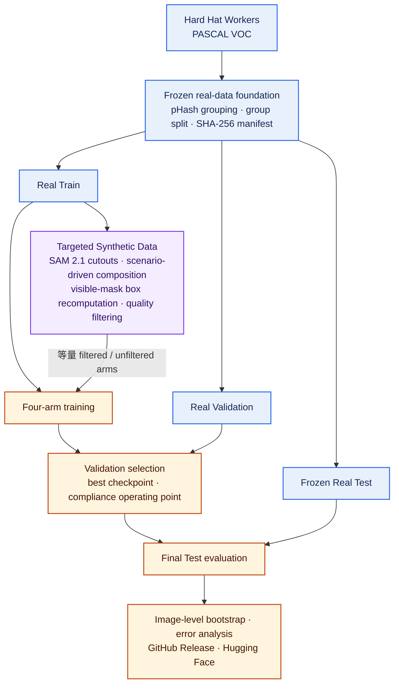
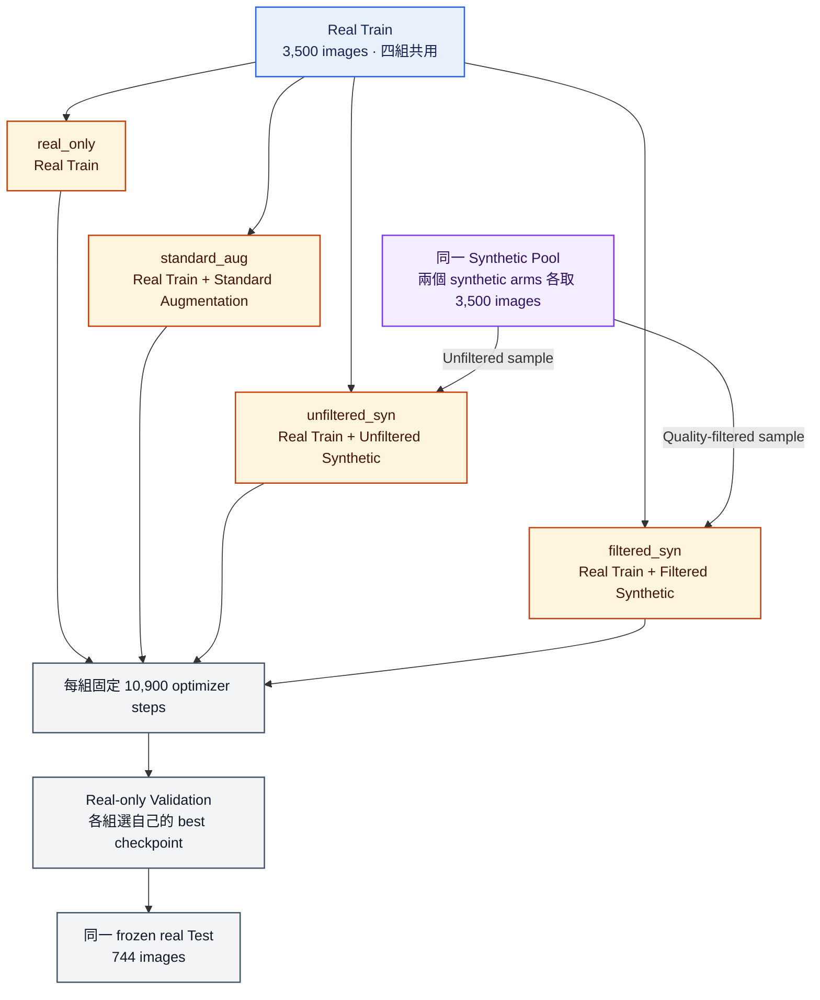
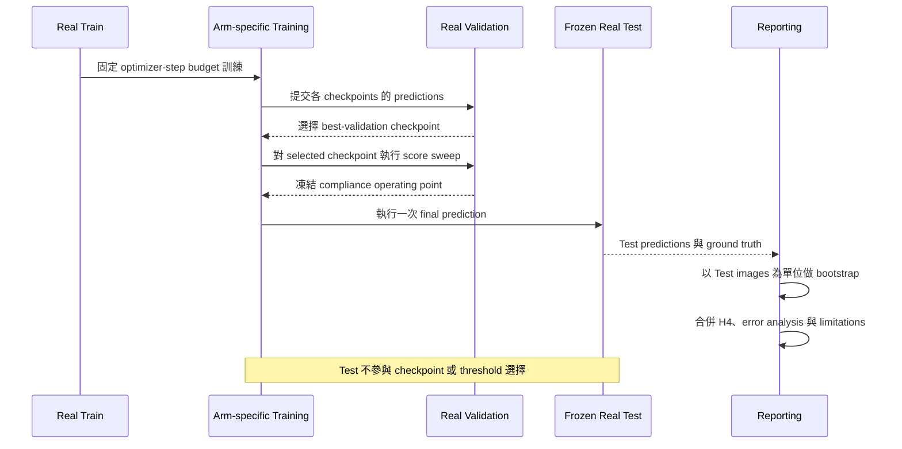

# SafeSynth：以受控實驗檢驗 Hard-Hat Detection 的 Targeted Synthetic Data

工地安全帽偵測最容易在真正重要的情境失效：遠距小目標、遮擋、擁擠、低光、
motion blur，以及少見但關鍵的 bare head。SafeSynth 不以大量生成取代真實資料，
而是針對這些 failure modes 建立自動標註的 Synthetic Data，並用嚴格的四組
controlled ablation 檢驗它是否真的改善 Object Detection。

> **English Abstract.** SafeSynth generates targeted, automatically labelled
> hard cases for hard-hat detection and evaluates them under a frozen four-arm
> protocol. On this dataset, RT-DETRv2 shows a statistically supported decline
> from synthetic augmentation, while RF-DETR-Nano reverses the point-estimate
> direction without separating confidence intervals. The result is therefore a
> negative finding documented with a reproducible protocol and artifacts, with a
> narrow low-label benefit; it is not a claim that synthetic data robustly
> improves detection.

## 核心結論

- **Synthetic Data 沒有穩健提升最終 Test 表現。** RT-DETRv2 的兩個 synthetic
  arms 在 `primary_map_small` 明顯低於 `real_only`；RF-DETR-Nano 的點估計方向反轉，
  但四組 confidence intervals 全部重疊。
- **過濾仍然有可量測價值。** `filtered_syn` 能在 compliance precision 限制下找到
  operating point，`unfiltered_syn` 則無法達標；這個效果沒有轉化成 AP 優勢。
- **Synthetic Data 在低標註曝光階段曾有效。** 以 real-image exposure 對齊時，
  `filtered_syn` 在前幾輪 Validation learning curve 領先，之後由 `real_only` 追過。
- **H4 artifact gate 預先警告了結果。** Copy-paste artifact 可被小型分類器高準確度
  分辨，表示 domain gap 不是主觀印象，而是可量測機制。
- **負面結果照原樣發布。** 最佳 checkpoint 是完全不使用 Synthetic Data 的
  `real_only`；發布它，而不是挑一個 synthetic arm，正是實驗結論的一部分。

### 公開資源

- [SafeSynth v1.0.0 GitHub Release](https://github.com/kuotunyu/SafeSynth/releases/tag/v1.0.0)
- [Source 與 reproducibility package](https://github.com/kuotunyu/SafeSynth)
- [等量 filtered／unfiltered Synthetic Dataset](https://huggingface.co/datasets/steven0226/safesynth-hard-hat)
- [Validation-selected RT-DETRv2-R18 checkpoint](https://huggingface.co/steven0226/safesynth-rtdetrv2-r18)

公開 checkpoint 是 `real_only` winner：使用 3,500 張 real Train images，Synthetic
Data 為零。

## 系統架構

SafeSynth 的研究對象是資料，不是偵測器本身。流程先凍結 real-data split，再建立
可追溯的合成素材與標註；Training、Validation 與 Test 的責任邊界從資料生成開始就
被分開。



### 為困難情境生成，而不是 bulk generation

生成器針對六類情境配置樣本：small／distant objects、partial occlusion、crowding、
low light、motion blur 與 bare heads；另加入黃色機具、圓形物體等 hard negatives，
要求模型不能把它們誤認為安全帽。

標註由生成流程自動產生。SAM 2.1 mask 只用來取得合成素材，絕不作為 Test ground
truth；compositor 貼上物件後，會依實際 visible mask 重新計算新物件與受遮擋舊物件
的 bounding boxes。每筆樣本都保留來源圖、來源 bbox、seed、參數、filter score 與
拒絕原因等 provenance。

最終從 14,000 個 candidates 得到 4,177 張 accepted images，輸出等量的
`filtered_syn` 與 `unfiltered_syn` arms，各 3,500 張。Emitted ground truth 的
COCO self-evaluation 為 mAP 1.000，用來確認輸出 box 與 COCO 格式語義一致。

### H4 artifact gate 與停止規則

Pre-registered H4 gate 的問題是：一個小型分類器能否區分 pasted patches 與 real
object patches？預先登記的上限為 **AUC 0.60**。在 group-disjoint、class- 與
size-matched 的 106,144 patches 上，HOG+HSV logistic regression 得到
**AUC 0.9053**（bootstrap 95% CI 0.9013–0.9090）。H4 **did not pass**，本專案也
不宣稱通過。

Feather search、multiband blending、Poisson blending、same-class in-place
replacement、exact-source paired control、FLUX.2 boundary inpainting、
whole-person pasting、regional placement 與 whole-image generation 都無法把
artifact signal 壓到門檻以下。依 [ADR-011](docs/decisions.md#adr-011)，這項失敗被
視為研究發現：生成規模停在 1x real-Train，不投入 2x，並讓 H4 AUC 與所有結果一起
揭露。

## 四組 Controlled Ablation

四組共享相同 frozen split、base model、optimizer-step budget 與 evaluation code。
`filtered_syn` 和 `unfiltered_syn` 從同一 pool 等量抽樣，避免把「資料更多」誤讀為
「資料更好」。



本研究採 four-arm（四組）設計，而不是 five-arm；**第五組 Full-real 不適用**，
因為 `real_only` 已經使用 **all real Train data**，沒有更高的 real-data ceiling。

固定 optimizer steps 會形成一個必須明示的 confound：synthetic arms 的 dataset 較大，
所以每張真實影像只被看見約一半次數。這不是註腳，而是結果表中的
`real-image exposures` 欄位。

## Evaluation Protocol 與防洩漏



- Validation 與 Test 只含 real images；generator 與 filter 不讀取 Test。
- Split manifest 在生成前以 seed、來源檔 SHA-256 與 pHash groups 凍結，同群影像不得
  分到不同 split。
- 每個 arm 用自己的 Validation-selected checkpoint 與 operating point，最後才在同一
  frozen Test 上評測。
- Confidence intervals 以 Test **images** 為重抽樣單位；同一張擁擠影像中的多個 head
  不能被當成互相獨立。
- Validation 和 Test 的 generator/filter reads 始終為零。

資料集本身有重要缺陷，而且必須在結果之前說清楚：
[SHEL5K（Sensors 2022）](https://www.mdpi.com/1424-8220/22/6/2315) 對同一批
5,000 張影像重新標註後得到 75,570 labels，原版只有 25,502；`person` 尤其不完整。因此
**All claims are relative; never absolute AP**：所有主張都只比較同一 frozen Test 上
arm A 與 arm B，不能把絕對 AP 當成資料集或模型的品質保證。

## 實驗結果

下列 RT-DETRv2-R18 四組各使用一個 seed、相同 10,900 optimizer steps，並在 frozen
744-image real Test split 上評測。所有數字都能從
[`results/detection_metrics.csv`](results/detection_metrics.csv) 重新聚合；CI 會執行
`scripts/verify_readme.py`，數字與來源不一致時直接失敗。


左右兩個 panel 必須一起閱讀：左圖顯示 full-budget Test 結果，右圖顯示低 real-label
exposure 階段的 learning curve。只報其中一張會形成 selective presentation。

兩套獨立實作計算主表，差異不超過 8.8e-07。

| Arm | primary_map_small <!--split: test--> | primary_map <!--split: test--> | bare_head_recall <!--split: test--> | real-image exposures |
|---|---:|---:|---:|---:|
| `real_only` | 0.4511 | 0.5341 | 0.9875 | 49.83 |
| `standard_aug` | 0.4236 | 0.4958 | 0.9875 | 49.83 |
| `unfiltered_syn` | 0.3759 | 0.4597 | 0.9898 | 24.91 |
| `filtered_syn` | 0.3664 | 0.4858 | 0.9886 | 24.91 |

`primary_*` 只涵蓋 `helmet` 與 `head`；標註品質差的 `person` 分開報告。
兩個 synthetic arms 在兩項 headline detection metrics 都低於 `real_only`。

### Confidence interval 改變了哪些說法

EVAL-09 對 Test images 做 1,000 次 percentile bootstrap。每格是 point estimate 與
95% interval：

| Arm | primary_map_small <!--split: test--> | bare_head_recall <!--split: test--> | ap.person <!--split: test--> |
|---|---|---|---|
| `real_only` | 0.4511 [0.4307, 0.4753] | 0.9875 [0.9790, 0.9943] | 0.0019 [0.0010, 0.0048] |
| `standard_aug` | 0.4236 [0.3993, 0.4530] | 0.9875 [0.9775, 0.9957] | 0.0152 [0.0028, 0.0463] |
| `unfiltered_syn` | 0.3759 [0.3474, 0.4064] | 0.9898 [0.9789, 0.9977] | 0.0080 [0.0034, 0.0191] |
| `filtered_syn` | 0.3664 [0.3426, 0.3956] | 0.9886 [0.9808, 0.9954] | 0.0074 [0.0024, 0.0242] |

- **`real_only` 優於兩個 synthetic arms：有支持。** `primary_map_small` intervals
  不重疊。
- **`real_only` 優於 `standard_aug`：沒有支持。** Intervals 重疊，0.0275 的點估計
  差距仍在 sampling uncertainty 內。
- **`filtered_syn` 在 detection metrics 優於 `unfiltered_syn`：沒有支持。** 三個
  metrics 的 intervals 都重疊。

Bootstrap 衡量的是 744-image Test sample 的 sampling uncertainty，不是不同 training
seeds 的 run-to-run variance；四組依然都只有 single seed。

### Bare-head recall 的兩種讀法

RT-DETRv2 每張影像固定輸出 300 queries；若在 IoU 0.50 且沒有 score floor 時配對，
幾乎每個 bare head 都能找到某個 box，所以 headline `bare_head_recall` 接近 ceiling。
在 frozen operating point 讀取同一指標，差異才會顯現：

| Arm | bare_head_recall_at_op | bare_head_recall <!--split: test--> |
|---|---:|---:|
| `real_only` | 0.8931 | 0.9875 |
| `filtered_syn` | 0.5575 | 0.9886 |
| `standard_aug` | 0.4687 | 0.9875 |
| `unfiltered_syn` | 0.3572 | 0.9898 |

右欄是無 score floor 的 ceiling；左欄才是 frozen compliance operating point。兩者的
spread 分別為 0.0023 與 0.5359。

### Synthetic Data 在哪個區間有效

若把橫軸改成 real Train 被看過的次數，在第一個 pass 時，`filtered_syn` 的 Validation
mAP 是 0.0904，`real_only` 是 0.0267；第二個 pass 分別為 0.2768 與 0.1864，
baseline 在第四與第五個 pass 之間反超。完整曲線與四組結果見
[`reports/exposure_analysis.md`](reports/exposure_analysis.md)。

因此，在真實標註稀少時，composites 最多提供 **+0.090 mAP**；這項領先在第四個 pass
後消失。這是「相同 labels、更多 compute」的比較，不是所有條件完全相同的比較。

### Filtering 唯一改變的部署條件

每組都在 Validation 以同一規則選 operating point：在 compliance precision 至少
0.80 的限制下最大化 bare-head recall。

| Arm | operating_point | op_bare_head_recall | op_compliance_precision |
|---|---:|---:|---:|
| `real_only` | 0.07 | 0.8575 | 0.8507 |
| `standard_aug` | 0.04 | 0.8431 | 0.8203 |
| `filtered_syn` | 0.07 | 0.6395 | 0.8076 |
| `unfiltered_syn` | — | — | — |

`unfiltered_syn` 在任何仍會產生 detection 的 threshold 上都達不到 precision 要求；
`filtered_syn` 可以。Filtering 的可量測價值在 compliance operating point，不在 AP。

### RF-DETR-Nano replication

RF-DETR-Nano 使用相同四組、seed 1337、10,900 optimizer steps、同一 frozen Test，並以
Test images 做 1,000 次 percentile bootstrap。來源為
[`results/rfdetr_detection_metrics.csv`](results/rfdetr_detection_metrics.csv)。

<!--metrics-source: rfdetr_detection_metrics.csv-->
| Arm | primary_map_small <!--split: test--> | primary_map <!--split: test--> | bare_head_recall <!--split: test--> | real_image_exposures <!--split: test--> |
|---|---:|---:|---:|---:|
| `real_only` | 0.4841 [0.4653, 0.5048] | 0.5657 | 0.9761 [0.9643, 0.9863] | 49.83 |
| `standard_aug` | 0.4970 [0.4727, 0.5219] | 0.5789 | 0.9681 [0.9539, 0.9809] | 49.83 |
| `unfiltered_syn` | 0.4959 [0.4747, 0.5194] | 0.5774 | 0.9750 [0.9596, 0.9865] | 24.91 |
| `filtered_syn` | 0.5030 [0.4841, 0.5240] | 0.5818 | 0.9863 [0.9777, 0.9938] | 24.91 |

RF-DETR-Nano 的 synthetic arms 點估計略高於 `real_only`，但四組
`primary_map_small` intervals 全部重疊，且每組仍只有 single seed；這不是有統計
支持的 Synthetic Data win。RT-DETRv2 與 RF-DETR 合在一起，只能支持「效果對
architecture 敏感且尚無定論」，不能支持「Synthetic Data 穩健改善 detection」。

### 為什麼結果會這樣

- **H4 事先指出 domain gap。** AUC 0.9053 表示 real 與 pasted patches 有明顯可分訊號。
- **Targeting 沒有命中預定 slice。** `small_distant` 佔 synthetic budget 中最大的
  可隔離份額 21.7%，但 `small_object` 反而是變化最不利的 slice：−0.0572；
  `crowded` 為 −0.0412，`low_light` 為 −0.0477。
- **Regression 不對稱。** 相較 `real_only`，`filtered_syn` 修復 73 個 false negatives，
  卻新增 1,304 個；修復 715 個 false positives，同時新增 291 個。完整四類 error grids
  位於 [`reports/figures/error_analysis/`](reports/figures/error_analysis/)。

## Demo


這是八張 Validation frames 組成的 montage，不是連續影片。綠框代表 helmeted head，
紅框代表 bare head；顏色表示 **compliance verdict**，不是模型信心。Caption 顯示
`compliant / total` 與 compliance rate。

Frames 只從 Validation 選取，不使用 Test；選圖規則先平衡兩種 verdict，再選 drawn
boxes 較少的畫面。資料集常被描述為 video-derived，但 frozen pHash grouping 顯示
4,808 groups 中有 4,643 組只有一張圖，最大 group 也只有 8 frames，沒有可當成連續
site footage 的片段。資料集中另有 501 張圖同時包含 helmeted 與 bare heads，足以
展示 compliance logic。

從公開 Hugging Face checkpoint 啟動 live demo：

```powershell
uvx hf download steven0226/safesynth-rtdetrv2-r18 --local-dir models/safesynth-rtdetrv2-r18
uv run python app.py --device cpu --weights models/safesynth-rtdetrv2-r18
```

重新產生 README GIF 是 maintainer workflow，需要外部 Validation images 與本機 training
run，不屬於 clean-clone quickstart：

```powershell
uv run python -m scripts.make_demo_gif
```

## Dataset

來源是 [Hard Hat Workers](https://www.kaggle.com/datasets/andrewmvd/hard-hat-detection)
（Kaggle `andrewmvd/hard-hat-detection`，CC0 1.0）：5,000 張 images、PASCAL VOC
boxes，三類為 `helmet` 18,966、`head` 5,785、`person` 751。

上游通常把解析度寫成 416×416，實際量測則有四種：416×415 為 2,461 張、416×416
為 2,192 張、415×416 為 324 張、415×415 為 23 張。雖然只差一 pixel，但 `head`
平均約 34×34 = 1,156 px²，接近 COCO small／medium 的 1,024 px² 邊界。Predictions
因此逐圖分別計算 `scale_x` 與 `scale_y` 映回原座標，不能使用單一 global scale。

公開 Synthetic Dataset 包含等量 filtered／unfiltered annotations 與
`records.jsonl` provenance。SAM 2.1 automatic masks 只負責合成素材，不是任何
Validation 或 Test ground truth。

## 已知限制（Limitations）

### 原始標註不完整

SHEL5K 對相同影像重新標註後，labels 約為原版三倍；原始 `person` 類尤其不完整。
這會壓低絕對 AP，因此本專案只做同一 frozen Test 上的相對 arm comparison，並將
`person` 從 primary metrics 分開。

### Copy-paste 在有限 backgrounds 上會飽和

Near-duplicate filter 會讓 marginal acceptance rate 隨 pool 成長下降：同一 config 與
seed 下，2,000 candidates 時為 58.4%，10,000 時為 33.8%，14,000 時為 29.8%；
`NEAR_DUPLICATE_SYNTHETIC` 最終成為最大拒絕原因。這是由 3,500 backgrounds 與
方法本身形成的 ceiling，不適合靠放寬 threshold 掩蓋。

### Hard-negative placement 只解決了一半

Distractors 加入與 annotated pastes 相同的 photometric path 與 ground-contact shadow
後，Laplacian variance 從 52.4 提升到 503.3；real helmets 為 1350.9。但沒有 depth
理解時，物件仍可能落在不合理位置。以 17,815 real annotations 對 normalized `cy`
回歸 `log(min_side)` 的 R² 只有 0.0001，資料本身沒有可用的 depth-size relation。

未佩戴的獨立安全帽不屬於 `helmet` label；例如 image 4029 的桌面上有三頂安全帽，
ground truth 仍是零個 helmet boxes。因此 hard-negative 的 label semantics 正確，
限制主要落在 realism 與 hard-negative false-positive metric 的難度。

### Single seed 與 latency

Bootstrap interval 不能取代多 seed training。最直接的後續研究是 real-data-fraction
ablation，以不同 real Train 比例檢查低標註區間的 crossover 是否重現。

Fine-tuned RF-DETR latency 不列入 release：五次 fixed-clock 測試都未通過預先登記的
host-contention p95 gate，即使 clock-spread gates 全部通過。這些紀錄只作 diagnostic
evidence，不降低 gate，也不挑選最有利的一次做 speed claim。

## 安裝與重現

專案以 Windows 11 native、Python 3.12、uv 與 RTX 4090 開發；不使用 WSL。完整版本
與 CUDA 說明見 [docs/environment.md](docs/environment.md)。

```powershell
git clone https://github.com/kuotunyu/SafeSynth.git
Set-Location SafeSynth
uv sync --locked
```

不需要外部 bulk data 即可驗證 repository 內的公開 evidence：

```powershell
uv run python -m scripts.verify_readme
uv run python -m scripts.check_forbidden_licences
uv run pytest -q
```

`scripts.verify_hf_release` 驗證的是完整 owner-upload payload，不是 repository-only
check。下載或準備好兩個 release bundles 後才能執行：

```powershell
uv run python -m scripts.verify_hf_release --dataset <dataset-bundle> --model <model-bundle>
```

Training 與資料生成需要下載公開 dataset／model weights，並依
[configs/paths.yaml](configs/paths.yaml) 設定 repository 之外的 data root。執行順序與
防洩漏規則分別記錄在：

| 工作 | 文件 |
|---|---|
| Data、split、COCO conversion | [docs/data_protocol.md](docs/data_protocol.md) |
| Cutout bank 與 composition | [docs/synthesis_spec.md](docs/synthesis_spec.md) |
| Filtering rules | [docs/filtering_spec.md](docs/filtering_spec.md) |
| Four-arm training | [docs/training_spec.md](docs/training_spec.md) |
| Metrics、bootstrap、error analysis | [docs/evaluation_spec.md](docs/evaluation_spec.md) |
| Experiment protocol 與 leakage guards | [docs/experiment_protocol.md](docs/experiment_protocol.md) |
| Reproducibility decisions | [docs/decisions.md](docs/decisions.md) |

Phase 1 的資料處理、SAM 2.1 inference、composition 與 filtering 在本機完成，API spend
為 $0。[RT-DETRv2 training summary](results/colab/training_summary.json) 記錄 NVIDIA L4、
bf16 四組 wall-clock 分別為 1.774、1.792、1.603、1.604 小時，合計 6.773 GPU-hours；
Colab compute units 的實際扣用量沒有保存在 release artifacts，因此不補做推估。
EVAL-09 的 image-level bootstrap 使用 16 CPU workers，實測 2 小時 20 分，紀錄在
[worklog](docs/worklog.md)。RF-DETR 四組在本機 RTX 4090 完成，但公開 evidence 沒有可供
引用的完整 wall-clock record。

大型 training artifacts 與逐次執行證據保存在外部 data root；公開結果、metrics、
release bundle 與驗證程式保留在 repository。

## License 與引用

程式碼採 [MIT License](LICENSE)。來源 dataset 為 CC0 1.0，SAM 2.1 weights 為
Apache-2.0；生成影像沿用來源授權，以 CC0 1.0 發布。

引用本專案時，請引用 [SafeSynth v1.0.0](https://github.com/kuotunyu/SafeSynth/releases/tag/v1.0.0)
與對應的 [Hugging Face Dataset](https://huggingface.co/datasets/steven0226/safesynth-hard-hat)，
並保留本 README 對 negative result、artifact gate 與 annotation defects 的說明。
