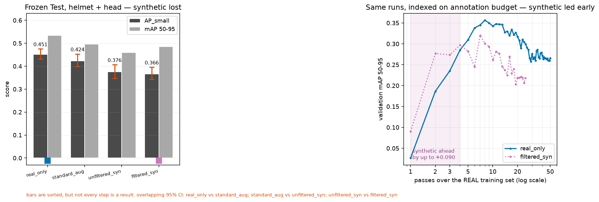
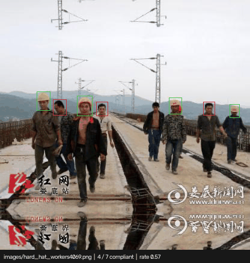

# SafeSynth — Targeted Synthetic Data for Hard-Hat Detection

Detecting whether construction workers wear their hard hats fails in exactly the
situations that matter: workers far from the camera, heads occluded by equipment,
crowded scenes, dusk and motion blur, and the rare-but-critical bare head. Real
datasets are thin precisely where the model is weak, and hand-labelling more of
those cases is expensive.

**This project generates the hard cases instead — with bounding-box labels
produced automatically by the generator, at zero annotation cost — and then
measures, under a controlled four-arm protocol, whether that actually helps.**

The answer, on this dataset, is **no** — and the interesting part is where the
"no" stops being true. [Results](#results) has the numbers.

This is not a "train a detector on a public dataset" tutorial. The subject of
the experiment is the *data*, not the model:

- **Targeted, not bulk.** Six scenarios are synthesized on purpose — small/distant
  objects, partial occlusion, crowding, low light, motion blur, and bare heads —
  plus hard negatives (yellow machinery, round objects) that look like helmets and
  must *not* fire.
- **Labels are free and exact.** SAM 2.1 produces clean cutout masks; the
  compositor recomputes every bounding box from the visible mask after pasting,
  including for pre-existing real objects that a paste occludes.
- **A filter that earns its place.** Geometric and photometric rules (a worn
  helmet must actually touch a head, visible fraction and size ratios must be
  plausible, no floating helmets, no clipping artifacts) emit a *filtered* and an
  *unfiltered* version of the same generated pool, size-matched, so the ablation
  isolates filtering quality from data quantity.
- **Honest measurement.** Validation and test are real images only; the generator
  and the filter never read the test split; the split manifest is frozen with
  SHA-256 before a single synthetic image is generated.

## Status

**Phase 1 is complete, and it produced a negative result worth stating up front.**

The pipeline works: a guarded, frozen 70/15/15 group split; a 7,255-item SAM 2.1
cutout bank; a deterministic compositor that recomputes every bounding box from
the visible mask; and a geometric, photometric and quality filter whose ledger
reconciles exactly. The delivered pool is 14,000 candidates yielding 4,177
accepted images, exported as size-matched filtered and unfiltered arms of 3,500
each with 0.5x nested inside 1x. COCO self-evaluation on the emitted ground
truth returns mAP 1.000, which is the check that the boxes mean what the format
says they mean.

**But the paste artifacts are detectable.** A pre-registered gate (H4) asked
whether a small classifier could distinguish pasted patches from real object
patches, with a pre-registered maximum of **AUC 0.60**. On a group-disjoint,
class- and size-matched split of 106,144 patches, a HOG+HSV logistic regression
reaches **AUC 0.9053** (bootstrap 95% CI 0.9013-0.9090). The gate did not pass,
and this repository does not claim that it did.

Nine synthesis routes were tried against it and all failed: feather-parameter
search, multiband blending, Poisson blending (AUC 0.8869 - it washes out the
helmet hue that carries the class signal), same-class in-place replacement
(0.8312), an exact-source paired control (0.9049), FLUX.2 reference-conditioned
boundary inpainting, whole-person pasting, regional placement, and whole-image
generation. A feature-family diagnostic shows HOG-only at 0.7792 and HSV-only at
0.6816 - both resampling/boundary *and* photometric signals exceed the bar, so
no single-parameter fix exists. An 18-round supervised auto-labeler effort
(v6 through v23) built to support the last of those routes was also stopped: its
best checkpoint peaks at confidence 0.14 with true- and false-positive score
distributions almost completely overlapping, which is an undertrained model
rather than a labeling-quality problem.

**The decision (ADR-011) is to treat this as a finding and measure what it
costs.** Generation is capped at 1x real-Train size (2x is explicitly not done,
since that is exactly the large investment the gate existed to prevent), and the
four-arm comparison runs with the H4 AUC reported alongside every result. If
synthetic data still helps, the conclusion is that detectable paste artifacts do
not prevent transfer. If it does not, AUC 0.9053 is the mechanism. Both outcomes
are reportable; neither is hidden.

### Two limits that constrain what this approach can deliver

**Copy-paste saturates on 3,500 backgrounds.** Acceptance is not a constant: the
near-duplicate filter compares each candidate against every already-accepted
sample, so the marginal rate decays as the pool grows. Measured on one config
and seed: 58.4% at 2,000 candidates, 33.8% at 10,000, 29.8% at 14,000, where
`NEAR_DUPLICATE_SYNTHETIC` becomes the single largest rejection reason. Reaching
1x needed 14,000 candidates. This is a ceiling of the method, not a threshold to
loosen, and it bounds how much distinct synthetic data this route can ever
produce from this dataset.

**Hard-negative placement is only half solved, and is shipped that way on
purpose.** Distractors were being composited with none of the photometric
treatment annotated pastes receive, and owner review correctly read every one of
them as pasted; surface texture by Laplacian variance was 52.4 against 1350.9
for real helmets. They now run the same path plus a ground-contact shadow,
reaching 503.3. What is *not* fixed is where they land: without depth
understanding an object can still sit in mid-air, and a shadow only helps where
a surface actually exists. A depth-aware size prior was measured and abandoned -
regressing log(min_side) on normalized cy over 17,815 real annotations gives
R^2 = 0.0001, so this dataset carries no depth-size relation to exploit.

This was accepted rather than fixed because the *labels* are right even where
the realism is not. The dataset does not annotate a helmet nobody is wearing -
image 4029 carries three helmets on a meeting-room table and zero helmet boxes -
so leaving a distractor unannotated matches the real labelling rule exactly. The
cost is confined to one secondary metric: these distractors skew easy, so
false positives per hard-negative image measures something weaker than intended.
The headline metrics, AP_small and bare-head recall, are unaffected.

Validation and Test reads remain at zero throughout.

See [PLAN.md](PLAN.md) for milestones and [docs/](docs/) for the specifications
each milestone is implemented against.

## Results

Four arms, one seed each, RT-DETRv2-R18, an equal optimizer-step budget of
10,900 steps, every arm scored at its own best-validation checkpoint on the
**frozen 744-image real Test split**. Every number below is re-aggregatable from
[`results/detection_metrics.csv`](results/detection_metrics.csv), and
`scripts/verify_readme.py` fails the build if one of them is not.



Both panels are the result. The left one alone says the method does not work;
the right one alone says it does. Reporting either without the other would be
the selective presentation this project's rules forbid.

Two independent implementations computed this table and agree to 8.8e-07.

| Arm | primary_map_small <!--split: test--> | primary_map <!--split: test--> | bare_head_recall <!--split: test--> | real-image exposures |
|---|---:|---:|---:|---:|
| `real_only` | 0.4511 | 0.5341 | 0.9875 | 49.83 |
| `standard_aug` | 0.4236 | 0.4958 | 0.9875 | 49.83 |
| `unfiltered_syn` | 0.3759 | 0.4597 | 0.9898 | 24.91 |
| `filtered_syn` | 0.3664 | 0.4858 | 0.9886 | 24.91 |

`primary_*` covers `helmet` and `head`; `person` is reported separately because
it is the badly annotated class. **Synthetic data did not help.** Both synthetic
arms sit below the real-only baseline on both headline metrics.

Two columns need reading carefully rather than at face value.

**Real-image exposures is a confound, not a footnote.** Fixing optimizer steps
(TRAIN-07) means the arms carrying twice the data see each real photograph half
as often — 24.91 passes against 49.83. That is a real difference between the
arms and it is in the table for that reason.

**The bare-head recall column is a ceiling, not a result.** RT-DETRv2 emits a
fixed 300 queries per image, so matched at IoU 0.50 with no score floor almost
every bare head finds some box and all four arms score ~0.99. Read at the frozen
operating point instead, the same metric separates them by half a point of
recall:

| Arm | bare_head_recall_at_op | bare_head_recall <!--split: test--> |
|---|---:|---:|
| `real_only` | 0.8931 | 0.9875 |
| `filtered_syn` | 0.5575 | 0.9886 |
| `standard_aug` | 0.4687 | 0.9875 |
| `unfiltered_syn` | 0.3572 | 0.9898 |

The right-hand column is the ceiling; the left is the same metric read at the
frozen operating point. The spread goes from 0.0023 to 0.5359.

### Where the synthetic data did work

Annotation is the resource this method claims to save, so the arms are also
compared at equal *annotation* budget rather than equal compute. Re-indexed onto
passes over the real training set (validation, single seed):

at one pass over the real training set `filtered_syn` scores 0.0904 validation
mAP against `real_only`'s 0.0267; at two passes, 0.2768 against 0.1864; the
baseline overtakes it between the fourth and fifth. The full curve, both
metrics and all four arms are in
[`reports/exposure_analysis.md`](reports/exposure_analysis.md) — those are
validation learning-curve readings rather than final Test results, so they live
in their own report and are not quoted as table rows here.

The composites are worth up to **+0.090 mAP** while real labels are scarce, and
that lead is gone by the fourth pass. This dataset supplies 5,000 labelled
images, which is the regime where synthetic augmentation has least to offer.
The caveat travels with the claim: matching real exposure *unmatches* compute,
so each row is *same labels, more compute* — the trade synthetic data offers,
but not *same conditions*.

### The one thing filtering decided

Each arm selected its own compliance operating point on Validation by the same
rule (maximise bare-head recall subject to ≥0.80 compliance precision):

| Arm | operating_point | op_bare_head_recall | op_compliance_precision |
|---|---:|---:|---:|
| `real_only` | 0.07 | 0.8575 | 0.8507 |
| `standard_aug` | 0.04 | 0.8431 | 0.8203 |
| `filtered_syn` | 0.07 | 0.6395 | 0.8076 |
| `unfiltered_syn` | — | — | — |

`unfiltered_syn` cannot reach the required precision at any threshold where it
detects anything. Filtering is the difference between an arm that can be
deployed as a compliance check and one that cannot — which is the clearest
result the filtering pipeline produced, inside an otherwise negative outcome.

### Why the result went the way it did

**H4 predicted it.** The pre-registered artifact gate asked whether a classifier
could tell a pasted patch from a real one, with a maximum of AUC 0.60. It
measured **0.9053**. The composites carry a detectable domain gap, and the
detection result is consistent with that warning. The gate was registered before
the training run and is reported beside every number here.

**The targeting did not land.** `small_distant` took the largest slice-isolable
share of the synthetic budget at 21.7%, and `small_object` is the slice that
moved *least* favourably: −0.0572 against −0.0412 for `crowded` and −0.0477 for
`low_light`. Whatever the synthetic images did, they did not move the slice they
were aimed at.

**The regression is asymmetric.** Against the baseline, `filtered_syn` repairs
73 false negatives and introduces 1,304 — eighteen broken for every one fixed —
while fixing 715 false positives at the cost of 291 new ones. Figures for all
four categories, including the new false positives, are in
[`reports/figures/error_analysis/`](reports/figures/error_analysis/); the
new-false-positive grid is not optional and is rendered by construction.

### Why four arms and not five

The general protocol these projects follow has a fifth arm: a full-real upper
bound, showing what the model reaches with all the real data available. **This
project has no such arm because Real-only already is it** — `real_only` trains
on the entire real Train split, so there is no higher real-data ceiling left to
add. Stating that is cheaper than letting a reader conclude an arm was dropped.

### What would have to be true for this to work

Every number above is a **single seed**, and EVAL-10 forbids reading a fraction
of a point as a win. The gaps here are large enough to be directional, but the
crossover point is not a measured constant.

The experiment this points at is a **real-data-fraction ablation**: retrain on
10%, 25% and 50% of the real training set with and without the same synthetic
pool. If the exposure reading above is right, the gap should widen as the real
fraction shrinks. It is also cheaper than the run already done, because every
arm in it trains on less data.

## Demo



Eight validation frames, annotated by the shipped `real_only` weights at the
EVAL-04 operating point of 0.07. Green is a helmeted head, red is a bare one,
and the caption carries the frame's `compliant / total` and rate — the colour
is the **compliance verdict**, not the class, so a red box means a person
without a hard hat rather than a detection the model was unsure about.

**This is a montage of still frames, not a video.** DEMO-04 asks for a recorded
clip; there is no site footage here, and the dataset cannot stand in for one —
its images are usually described as video-derived, but the frozen pHash
grouping says 4,643 of 4,808 groups are a single image and the largest is 8
frames, so no run of consecutive frames exists. What the dataset does have is
501 images containing both a helmeted and a bare head, which is what DEMO-04
actually asks the picture to show.

Frames come from Validation, never Test, and are chosen by a stated rule:
balance between the two verdicts first, then fewest drawn boxes. Run it with
`uv run python -m scripts.make_demo_gif`. The live demo is `app.py`:

```bash
uv run python app.py --device cpu
```

## Dataset

[Hard Hat Workers](https://www.kaggle.com/datasets/andrewmvd/hard-hat-detection)
(Kaggle `andrewmvd/hard-hat-detection`, CC0 1.0): 5,000 images, PASCAL VOC boxes,
three classes — `helmet` (18,966), `head` (5,785), `person` (751).

Every upstream source describes these images as 416x416. Measuring them says
otherwise: 416x415 is the plurality at 2,461 images, against 2,192 at 416x416,
324 at 415x416 and 23 at 415x415. The difference is one pixel and nothing
raises, but `head` averages roughly 34x34 = 1,156 px², which sits right beside
the COCO small/medium boundary of 1,024 — so a single global rescale factor
would move objects between buckets and quietly change what `AP_small` measures.
Predictions are therefore mapped back per image, with `scale_x` and `scale_y`
computed separately.

A documented caveat shapes the entire evaluation design: SHEL5K
([Sensors 2022](https://www.mdpi.com/1424-8220/22/6/2315)) re-annotated these
same 5,000 images and produced 75,570 labels against the original 25,502, and
describes the `person` class as poorly labelled. Roughly two thirds of true
objects carry no box here. Absolute AP on this benchmark is therefore depressed
for every class, which is why **every claim in this repository is relative** —
arm A versus arm B on one identical frozen test set — and never absolute. See
[docs/data_protocol.md](docs/data_protocol.md).

## Environment

Windows 11 native (no WSL), RTX 4090, Python 3.12, uv. Setup and the pinned
versions are in [docs/environment.md](docs/environment.md).

## License

Code is MIT. The source dataset is CC0 1.0; SAM 2.1 weights are Apache-2.0;
generated images are released as CC0 1.0 to match their source. See
[LICENSE](LICENSE).
