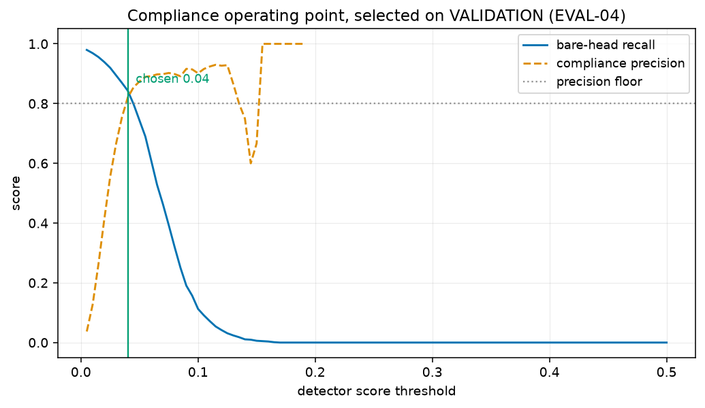

# Compliance operating point (EVAL-04)

Swept on the **frozen validation split** (756 images) using `standard_aug` at `checkpoint-3504`. Never swept on Test: `sweep_operating_points` takes the split name and raises on `"test"`, so tuning on the test set fails rather than producing a number.

This threshold is deliberately separate from mAP evaluation, which integrates over every confidence. A deployed compliance check has to commit to one point.

| threshold | bare-head recall | compliance precision | pred. compliant | pred. non-compliant |
|---:|---:|---:|---:|---:|
| 0.005 | 0.9796 | 0.0371 | 77473 | 37678 |
| 0.010 | 0.9689 | 0.1268 | 22441 | 14786 |
| 0.015 | 0.9557 | 0.2633 | 10663 | 6418 |
| 0.020 | 0.9389 | 0.4140 | 6643 | 3413 |
| 0.025 | 0.9198 | 0.5555 | 4839 | 2166 |
| 0.030 | 0.8946 | 0.6653 | 3905 | 1592 |
| 0.035 | 0.8695 | 0.7540 | 3276 | 1262 |
| 0.040 **←** | 0.8431 | 0.8203 | 2772 | 1065 |
| 0.045 | 0.7976 | 0.8548 | 2363 | 922 |
| 0.050 | 0.7437 | 0.8741 | 1993 | 802 |
| 0.055 | 0.6898 | 0.8895 | 1629 | 702 |
| 0.060 | 0.6096 | 0.8919 | 1295 | 601 |
| 0.065 | 0.5281 | 0.8978 | 1008 | 507 |
| 0.070 | 0.4635 | 0.8987 | 750 | 438 |
| 0.075 | 0.3928 | 0.9024 | 574 | 371 |
| 0.080 | 0.3198 | 0.8989 | 435 | 304 |
| 0.085 | 0.2503 | 0.8915 | 341 | 238 |
| 0.090 | 0.1904 | 0.9163 | 251 | 177 |
| 0.095 | 0.1569 | 0.9144 | 187 | 146 |
| 0.100 | 0.1126 | 0.9014 | 142 | 106 |
| 0.105 | 0.0910 | 0.9159 | 107 | 85 |
| 0.110 | 0.0719 | 0.9241 | 79 | 67 |
| 0.115 | 0.0539 | 0.9298 | 57 | 50 |
| 0.120 | 0.0419 | 0.9268 | 41 | 39 |
| 0.125 | 0.0311 | 0.9286 | 28 | 30 |
| 0.130 | 0.0240 | 0.8667 | 15 | 24 |
| 0.135 | 0.0180 | 0.8000 | 10 | 18 |
| 0.140 | 0.0108 | 0.7500 | 8 | 11 |
| 0.145 | 0.0096 | 0.6000 | 5 | 9 |
| 0.150 | 0.0060 | 0.6667 | 3 | 6 |
| 0.155 | 0.0048 | 1.0000 | 1 | 5 |
| 0.160 | 0.0036 | 1.0000 | 1 | 3 |
| 0.165 | 0.0012 | 1.0000 | 1 | 1 |
| 0.170 | 0.0000 | 1.0000 | 1 | 0 |
| 0.175 | 0.0000 | 1.0000 | 1 | 0 |
| 0.180 | 0.0000 | 1.0000 | 1 | 0 |
| 0.185 | 0.0000 | 1.0000 | 1 | 0 |
| 0.190 | 0.0000 | 1.0000 | 1 | 0 |
| 0.195 | 0.0000 | — | 0 | 0 |
| 0.200 | 0.0000 | — | 0 | 0 |
| 0.205 | 0.0000 | — | 0 | 0 |
| 0.210 | 0.0000 | — | 0 | 0 |
| 0.215 | 0.0000 | — | 0 | 0 |
| 0.220 | 0.0000 | — | 0 | 0 |
| 0.225 | 0.0000 | — | 0 | 0 |
| 0.230 | 0.0000 | — | 0 | 0 |
| 0.235 | 0.0000 | — | 0 | 0 |
| 0.240 | 0.0000 | — | 0 | 0 |
| 0.245 | 0.0000 | — | 0 | 0 |
| 0.250 | 0.0000 | — | 0 | 0 |
| 0.255 | 0.0000 | — | 0 | 0 |
| 0.260 | 0.0000 | — | 0 | 0 |
| 0.265 | 0.0000 | — | 0 | 0 |
| 0.270 | 0.0000 | — | 0 | 0 |
| 0.275 | 0.0000 | — | 0 | 0 |
| 0.280 | 0.0000 | — | 0 | 0 |
| 0.285 | 0.0000 | — | 0 | 0 |
| 0.290 | 0.0000 | — | 0 | 0 |
| 0.295 | 0.0000 | — | 0 | 0 |
| 0.300 | 0.0000 | — | 0 | 0 |
| 0.350 | 0.0000 | — | 0 | 0 |
| 0.400 | 0.0000 | — | 0 | 0 |
| 0.500 | 0.0000 | — | 0 | 0 |

## Selected

- `compliance.score_threshold` = **0.04**
- bare-head recall 0.8431
- compliance precision 0.8203 (floor 0.80)
- ground-truth bare heads in validation: 835

Write this value into `configs/evaluation.yaml` under `compliance.score_threshold` and change its `source:` tag from `validation (placeholder)` to `validation`. It is then frozen: re-selecting it after seeing Test results would be tuning on Test.
