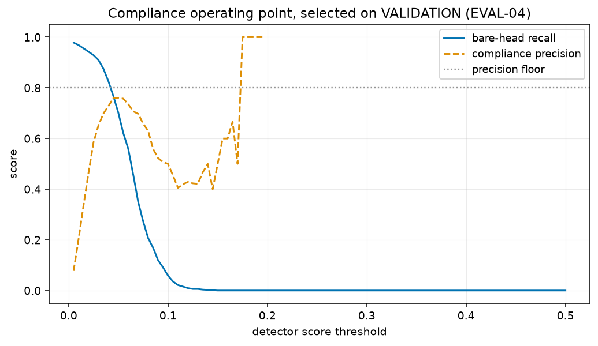

# Compliance operating point (EVAL-04)

Swept on the **frozen validation split** (756 images) using `unfiltered_syn` at `checkpoint-3942`. Never swept on Test: `sweep_operating_points` takes the split name and raises on `"test"`, so tuning on the test set fails rather than producing a number.

This threshold is deliberately separate from mAP evaluation, which integrates over every confidence. A deployed compliance check has to commit to one point.

| threshold | bare-head recall | compliance precision | pred. compliant | pred. non-compliant |
|---:|---:|---:|---:|---:|
| 0.005 | 0.9784 | 0.0776 | 36928 | 41213 |
| 0.010 | 0.9689 | 0.2025 | 13780 | 13280 |
| 0.015 | 0.9557 | 0.3362 | 7932 | 5299 |
| 0.020 | 0.9425 | 0.4643 | 5371 | 2808 |
| 0.025 | 0.9293 | 0.5838 | 3888 | 1804 |
| 0.030 | 0.9102 | 0.6514 | 2966 | 1372 |
| 0.035 | 0.8754 | 0.6987 | 2227 | 1098 |
| 0.040 | 0.8263 | 0.7276 | 1652 | 929 |
| 0.045 | 0.7677 | 0.7591 | 1179 | 819 |
| 0.050 | 0.7018 | 0.7611 | 833 | 707 |
| 0.055 | 0.6216 | 0.7573 | 581 | 608 |
| 0.060 | 0.5593 | 0.7354 | 412 | 530 |
| 0.065 | 0.4575 | 0.7072 | 304 | 420 |
| 0.070 | 0.3497 | 0.6972 | 218 | 314 |
| 0.075 | 0.2731 | 0.6588 | 170 | 244 |
| 0.080 | 0.2072 | 0.6304 | 138 | 183 |
| 0.085 | 0.1689 | 0.5588 | 102 | 150 |
| 0.090 | 0.1198 | 0.5227 | 88 | 108 |
| 0.095 | 0.0910 | 0.5072 | 69 | 82 |
| 0.100 | 0.0587 | 0.5000 | 54 | 54 |
| 0.105 | 0.0359 | 0.4545 | 44 | 34 |
| 0.110 | 0.0216 | 0.4054 | 37 | 22 |
| 0.115 | 0.0156 | 0.4194 | 31 | 15 |
| 0.120 | 0.0096 | 0.4286 | 28 | 8 |
| 0.125 | 0.0060 | 0.4231 | 26 | 5 |
| 0.130 | 0.0060 | 0.4211 | 19 | 5 |
| 0.135 | 0.0036 | 0.4667 | 15 | 3 |
| 0.140 | 0.0024 | 0.5000 | 12 | 2 |
| 0.145 | 0.0012 | 0.4000 | 10 | 1 |
| 0.150 | 0.0000 | 0.5000 | 8 | 0 |
| 0.155 | 0.0000 | 0.6000 | 5 | 0 |
| 0.160 | 0.0000 | 0.6000 | 5 | 0 |
| 0.165 | 0.0000 | 0.6667 | 3 | 0 |
| 0.170 | 0.0000 | 0.5000 | 2 | 0 |
| 0.175 | 0.0000 | 1.0000 | 1 | 0 |
| 0.180 | 0.0000 | 1.0000 | 1 | 0 |
| 0.185 | 0.0000 | 1.0000 | 1 | 0 |
| 0.190 | 0.0000 | 1.0000 | 1 | 0 |
| 0.195 | 0.0000 | 1.0000 | 1 | 0 |
| 0.200 | 0.0000 | — | 0 | 0 |
| 0.205 | 0.0000 | — | 0 | 0 |
| 0.210 | 0.0000 | — | 0 | 0 |
| 0.215 | 0.0000 | — | 0 | 0 |
| 0.220 | 0.0000 | — | 0 | 0 |
| 0.225 | 0.0000 | — | 0 | 0 |
| 0.230 | 0.0000 | — | 0 | 0 |
| 0.235 | 0.0000 | — | 0 | 0 |
| 0.240 | 0.0000 | — | 0 | 0 |
| 0.245 | 0.0000 | — | 0 | 0 |
| 0.250 | 0.0000 | — | 0 | 0 |
| 0.255 | 0.0000 | — | 0 | 0 |
| 0.260 | 0.0000 | — | 0 | 0 |
| 0.265 | 0.0000 | — | 0 | 0 |
| 0.270 | 0.0000 | — | 0 | 0 |
| 0.275 | 0.0000 | — | 0 | 0 |
| 0.280 | 0.0000 | — | 0 | 0 |
| 0.285 | 0.0000 | — | 0 | 0 |
| 0.290 | 0.0000 | — | 0 | 0 |
| 0.295 | 0.0000 | — | 0 | 0 |
| 0.300 | 0.0000 | — | 0 | 0 |
| 0.350 | 0.0000 | — | 0 | 0 |
| 0.400 | 0.0000 | — | 0 | 0 |
| 0.500 | 0.0000 | — | 0 | 0 |

## No point clears the floor

No swept threshold reaches a compliance precision of 0.80. Reported as it is rather than by lowering the floor to manufacture a selection: the floor is a statement about what a safety check has to be worth, and moving it after seeing the curve would make it meaningless. The remedy is a better detector, not a softer criterion.
