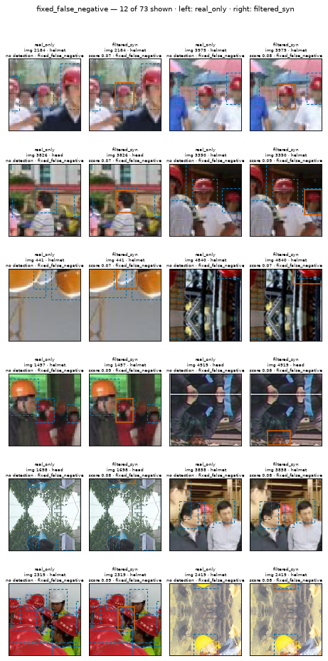
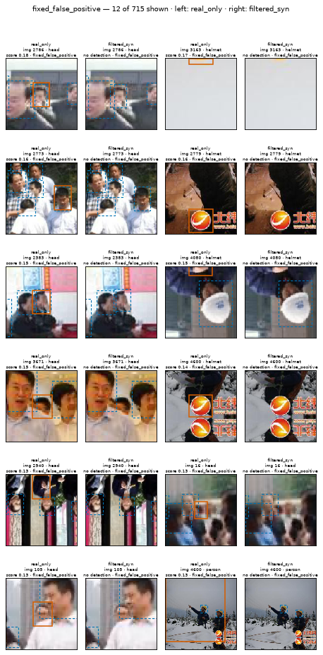
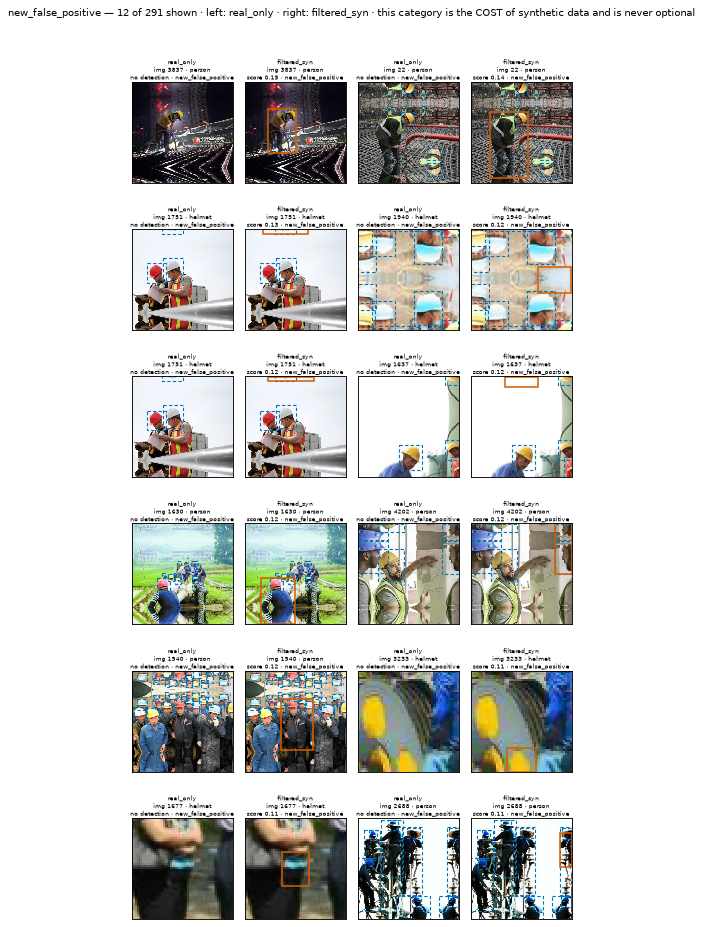
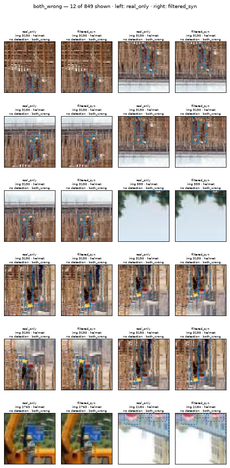

# Error analysis

Generated by `scripts/error_analysis.py`. Implements **EVAL-15** (four-way FP/FN comparison), **EVAL-16** (hard-negative subset), **EVAL-17** (scenario slices and the targeting test) and **EVAL-18** (the negative-result path). Every threshold comes from `configs/evaluation.yaml`; every number here is also in `reports/error_analysis.json` so the tables can be re-aggregated (EVAL-12).

Standing caveat (ADR-003): roughly two thirds of the real objects in this dataset are unannotated, so every statement below is a RELATIVE one between two arms on the same frozen Test split. A box counted as a false positive here may be a correctly detected object that nobody labelled.

## 1. Four-way comparison (EVAL-15)

Baseline `real_only` against best `filtered_syn`, at IoU 0.5 and score threshold 0.07. Ground-truth boxes both arms found, and images where neither arm fired, are agreement and do not appear below.

| category | count | % of disagreements | rendered |
|---|---:|---:|---|
| `fixed_false_negative` | 73 | 2.3% | [figure](figures/error_analysis/fixed_false_negative.png) |
| `fixed_false_positive` | 715 | 22.1% | [figure](figures/error_analysis/fixed_false_positive.png) |
| `new_false_positive` | 291 | 9.0% | [figure](figures/error_analysis/new_false_positive.png) |
| `new_false_negative` | 1,304 | 40.3% | counted only (not a configured category) |
| `both_wrong` | 849 | 26.3% | [figure](figures/error_analysis/both_wrong.png) |
| **total** | 3,232 | 100.0% | |

`new_false_positive` is the cost of synthetic data and cannot be omitted: `assert_reportable_categories` refuses to render any report whose category list drops it.

`new_false_negative` — the baseline found the box and the best arm lost it — is not one of the four categories in `configs/evaluation.yaml`, because it is not 'neither got it right'. It is counted here anyway. It is the recall-side twin of `new_false_positive`, and leaving it out would put a hole exactly where a synthetic-data regression falls.

**No comparison grid is rendered for `new_false_negative` (1,304, 40.3%).** That is 40.3% of all disagreements — which can exceed categories that do get a figure. Which categories are rendered is fixed by `error_analysis.categories` in `configs/evaluation.yaml`; adding one is a config change, not a code change, and the counts above already hold the numbers either way.

### By class

| category | `head` | `helmet` | `person` |
|---|---:|---:|---:|
| `fixed_false_negative` | 5 | 65 | 3 |
| `fixed_false_positive` | 201 | 426 | 88 |
| `new_false_positive` | 29 | 201 | 61 |
| `new_false_negative` | 300 | 1,003 | 1 |
| `both_wrong` | 124 | 610 | 115 |

### `fixed_false_negative`

12 of 73 shown. Left panel `real_only`, right panel `filtered_syn`. Dashed blue is ground truth, solid orange is that arm's detection.

### `fixed_false_positive`

12 of 715 shown. Left panel `real_only`, right panel `filtered_syn`. Dashed blue is ground truth, solid orange is that arm's detection.

### `new_false_positive`

12 of 291 shown. Left panel `real_only`, right panel `filtered_syn`. Dashed blue is ground truth, solid orange is that arm's detection.

### `both_wrong`

12 of 849 shown. Left panel `real_only`, right panel `filtered_syn`. Dashed blue is ground truth, solid orange is that arm's detection.

## 2. Hard-negative subset (EVAL-16)

Test images with no `helmet` and no `head` ground truth. A hard negative cannot contribute recall, only precision, so diluting it into mAP over the whole split hides the effect it exists to produce.

**This Test split has no natural hard negatives.** Every frozen Test image carries at least one primary-class box, so there is no subset on which a false positive can be counted without a true positive nearby, and no per-image rate is reported here.

EVAL-16 anticipates this: the fallback is to mark candidate regions on Test with the cutout miner **for analysis only, never for training**, and measure the rate on those. Until that subset exists, the `hard_negative` synthesis scenario has no direct verification on Test, and its share of the budget is spend whose effect this report cannot confirm.

## 3. Scenario slices (EVAL-17)

Slices come from `src/evaluation/slices.py` and are **not** mutually exclusive. Instance counts sit beside every metric because an AP over nine instances and an AP over nine hundred read identically (EVAL-08).

Metric: `primary_map`.

| slice | images | instances | `filtered_syn` | `real_only` | `standard_aug` | `unfiltered_syn` |
|---|---:|---:|---:|---:|---:|---:|
| `crowded` | 152 | 1,872 | 0.4805 | 0.5217 | 0.4926 | 0.4833 |
| `low_light` | 186 | 856 | 0.5021 | 0.5498 | 0.4998 | 0.4663 |
| `small_object` | 441 | 2,992 | 0.4662 | 0.5234 | 0.4890 | 0.4566 |

Change from `real_only` to `filtered_syn`:

| slice | delta |
|---|---:|
| `crowded` | -0.0412 |
| `low_light` | -0.0477 |
| `small_object` | -0.0572 |

Delivered synthetic budget, by scenario:

| scenario | share of delivered images | slice it targets |
|---|---:|---|
| `head_no_helmet` | 22.1% | no slice isolates it |
| `small_distant` | 21.7% | `small_object` |
| `partial_occlusion` | 18.4% | no slice isolates it |
| `crowded` | 14.1% | `crowded` |
| `hard_negative` | 13.3% | no slice isolates it |
| `low_light_blur` | 10.4% | `low_light` |

### Was the targeting real?

**Verdict: `target_slice_did_not_improve`.** The largest share overall went to `head_no_helmet` (22.1%), which no EVAL-17 slice isolates. The largest share that a slice DOES isolate is `small_distant` (21.7%), whose slice is `small_object`, and that is what is tested here. On `primary_map`, the best arm moves that slice by -0.0572; the best any other slice moved is -0.0412 (`crowded` -0.0412, `low_light` -0.0477). The slice the budget was aimed at did not improve at all, so the targeting claim fails on its own terms: whatever the synthetic images did, they did not move `small_object`.

## 4. If synthetic did not help (EVAL-18)

Headline metric: `eval_map`.

| arm | value | vs baseline |
|---|---:|---:|
| `real_only` | 0.3564 | baseline |
| `standard_aug` | 0.3281 | -0.0283 |
| `filtered_syn` | 0.3200 | -0.0364 |
| `unfiltered_syn` | 0.2988 | -0.0577 |

**No synthetic arm beats `real_only` on `eval_map`.** This is the negative-result path. Per docs/experiment_protocol.md §7 the result is reported as it is and the following checklist is walked; selective reporting or silently switching metrics is not allowed.

| # | question | where the evidence is |
|---:|---|---|
| 1 | Did the H4 paste-artifact gate actually pass, or is the synthetic data trivially separable from real data? | reports/h4_artifact_gate_m13.md and ADR-011 in docs/decisions.md |
| 2 | Did the delivered synthetic mix land in the target scenarios, or did per-scenario filter pass rates move it somewhere else? | reports/synthetic_stats.md cross-tab, and the delivered shares in the EVAL-17 section of this report |
| 3 | Is one filter threshold doing all of the work (FILT-14)? | reports/threshold_sensitivity.md |
| 4 | Does the standard_aug baseline already supply the variation the synthetic images add (EXP-01)? | the standard_aug versus real_only rows of the main table, and configs/training.yaml `augmentation` |
| 5 | Did the fixed optimizer-step budget cost the synthetic arms real-image exposure (TRAIN-07)? | computed below from src.training.arms.equal_step_budget, not copied from the run log |

### The equal-step exposure confound

TRAIN-07 fixes the optimizer-step budget at **10,900 steps** for every arm (batch size 16, 50 epochs for `real_only`). An arm carrying synthetic data therefore covers fewer epochs and sees each REAL image fewer times. Recomputed here by `src.training.arms.equal_step_budget`, not copied from the run log:

| arm | real-image exposures | relative to baseline |
|---|---:|---:|
| `real_only` | 49.83 | baseline |
| `standard_aug` | 49.83 | 1.00x |
| `filtered_syn` | 24.91 | 0.50x |
| `unfiltered_syn` | 24.91 | 0.50x |

This is a confound, not a footnote. The synthetic arms are not only different in what they trained on; they are also different in how often they saw the real images the Test set resembles. A loss under this budget does not by itself establish that the synthetic images are harmful, and a win would have been the stronger claim precisely because it came with less real-image exposure.
