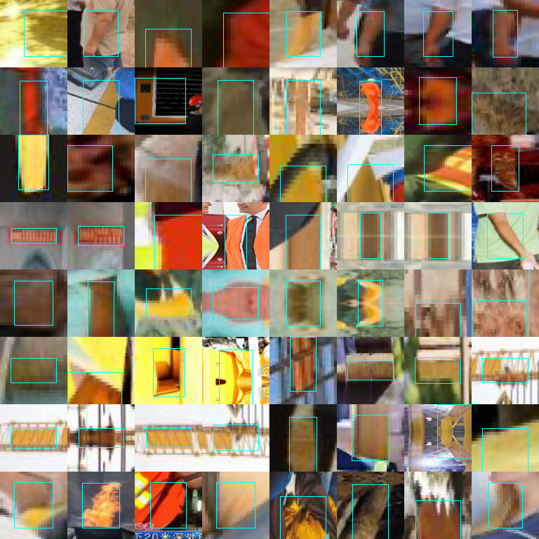

# EVAL-16 — false positives on hard-negative regions (Test)

> **Analysis only.** The frozen Test split contains no naturally empty
> images - all 744 carry a helmet or a head - so the subset EVAL-16 asks
> for is empty. This is the spec's own fallback: mine candidate regions on
> Test and measure against those. Nothing here feeds training, and the
> operating point is read from `configs/evaluation.yaml`, where EVAL-04
> placed it after selecting on Validation. No threshold is searched here.

## Result

Mined regions: **290** across **210** Test images, at score threshold `0.07`.

| Arm | false positives | per image |
|---|---:|---:|
| `unfiltered_syn` | 0 | 0.000 |
| `real_only` | 1 | 0.005 |
| `standard_aug` | 1 | 0.005 |
| `filtered_syn` | 1 | 0.005 |

**This metric does not separate the arms, and the numbers above
should not be read as a ranking.** The spread across four arms is
1 detection(s). Comparing 0.005 against 0.000
here would be reading noise.

The contact sheet below shows why, and it confirms a cost this
project already disclosed ([K-11](../docs/troubleshooting.md)): the
miner selects on HUE and roundness, so most of what it finds is
yellow or orange but nothing like a helmet in shape - planks,
barriers, machinery panels, bare arms. Those are not hard for the
detector, so no arm fires on them and there is nothing to compare.
A genuinely discriminating version of EVAL-16 would need
distractors that are helmet-SHAPED and not worn, which this
dataset does not supply in quantity on Test.

## What was mined

Guard rejections: `{'annotation_overlap': 995, 'head_like_region_below': 1969, 'inside_helmet_typical_range': 403}`

64 of 290 regions shown, cyan box on the region itself.

Phase 1 purity was human-checked on TRAIN: 64 cells, **0 real helmets**,
against a maximum tolerated 10% (`reports/h6_hard_negative_spike.md`). The
guards are content-based rather than split-dependent, so that expectation
should carry to Test - but it is an expectation, and this sheet is what
lets someone confirm it instead of taking it on trust.

## Why this is defined over mined regions and not over unmatched detections

Roughly two thirds of real objects in this dataset are unannotated
(SHEL5K re-labelled the same 5,000 images and found 75,570 objects against
the original 25,502). A detection with no matching ground truth is
therefore usually a CORRECT detection of an unannotated object, and
counting those as false positives would measure the annotation gap. A
mined region has passed the worn-helmet guards, so a box on one is an
error rather than a gap.
