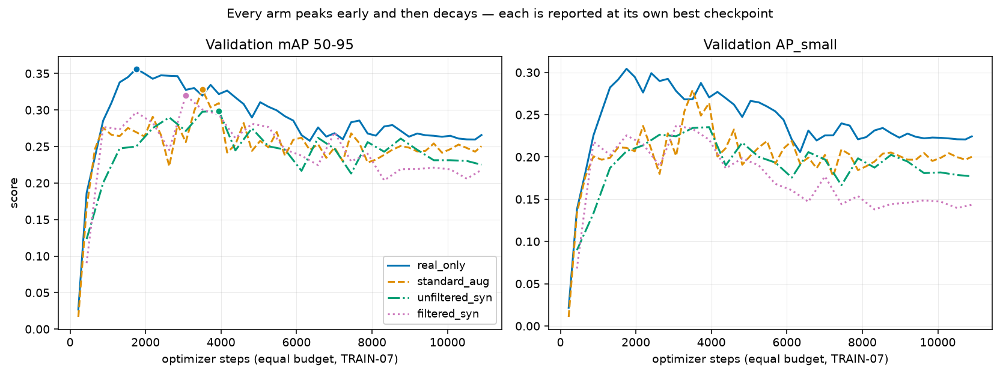

# Validation curves, re-aggregated from trainer_state.json

Read from each arm's last checkpoint (EVAL-12: never copied from the notebook display). Validation only — the Test numbers live in the main table.

| arm | eval points | best mAP | at step | final mAP | decay from peak |
|---|---:|---:|---:|---:|---:|
| `real_only` | 50 | 0.3564 | 1752 | 0.2657 | −0.0907 |
| `standard_aug` | 50 | 0.3281 | 3504 | 0.2504 | −0.0777 |
| `filtered_syn` | 25 | 0.3200 | 3066 | 0.2179 | −0.1021 |
| `unfiltered_syn` | 25 | 0.2988 | 3942 | 0.2251 | −0.0737 |

Every arm decays after its peak; the largest fall is `filtered_syn` at −0.1021 mAP from step 3066 to the end. The schedule was far longer than this dataset needs. Because `load_best_model_at_end` selects on validation mAP, each arm is reported at its own best checkpoint, so the comparison is between four early-stopped models rather than four over-trained ones.

The arms carrying synthetic data record half as many eval points for the same step budget: TRAIN-07 fixes optimizer steps, so twice the data means half the epochs, and each real image is seen about half as often. That confound belongs beside any comparison of these curves.
